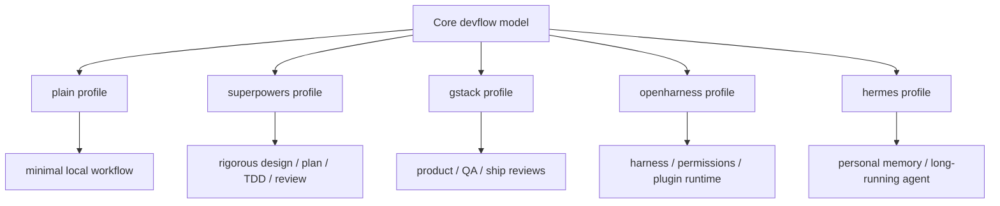

# Profile Map

```mermaid
flowchart TD
  Core[Core devflow model] --> Plain[plain profile]
  Core --> Superpowers[superpowers profile]
  Core --> Gstack[gstack profile]
  Core --> OpenHarness[openharness profile]
  Core --> Hermes[hermes profile]

  Superpowers --> Rigorous[rigorous design / plan / TDD / review]
  Gstack --> Product[product / QA / ship reviews]
  OpenHarness --> Harness[harness / permissions / plugin runtime]
  Hermes --> Memory[personal memory / long-running agent]
  Plain --> Fast[minimal local workflow]
```

Profiles may change prompts, strictness, and recommended gates. They must not
replace the core model: project, work item, session, gate, review, handoff.

