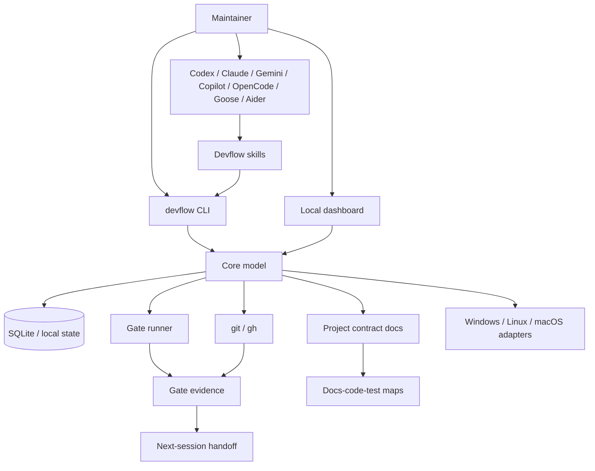

# System Map

## Ownership

- Core owns normalized project state.
- CLI owns mutation and automation commands.
- Dashboard owns visualization.
- Skills own agent behavior.
- Profiles own methodology differences.
- Adapters own external tool formats.
