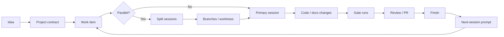

# Workflow Map

```mermaid
flowchart LR
  Idea[Idea] --> Contract[Project contract]
  Contract --> Work[Work item]
  Work --> Split{Parallel?}
  Split -->|No| Session[Primary session]
  Split -->|Yes| Parallel[Split sessions]
  Parallel --> Worktrees[Branches / worktrees]
  Worktrees --> Session
  Session --> Changes[Code / docs changes]
  Changes --> Gates[Gate runs]
  Gates --> Review[Review / PR]
  Review --> Finish[Finish]
  Finish --> Handoff[Next-session prompt]
  Handoff --> Work
```

## Rule

The loop is not complete until the next session can continue without asking the
maintainer to reconstruct context from memory.

